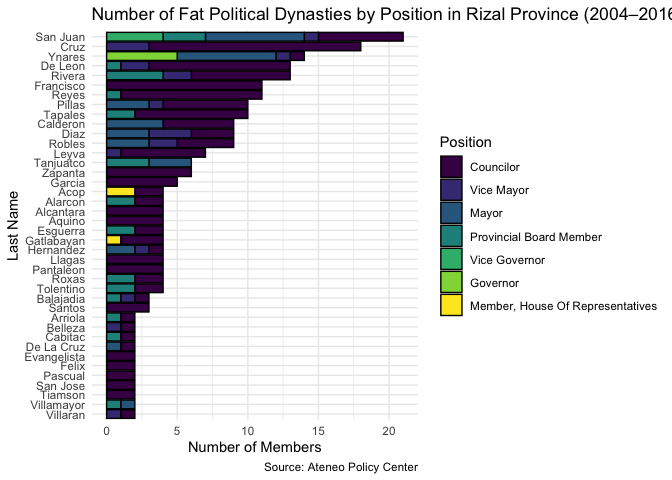
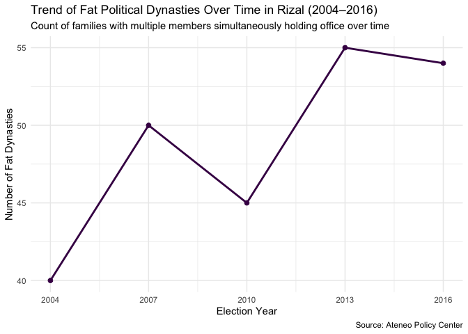
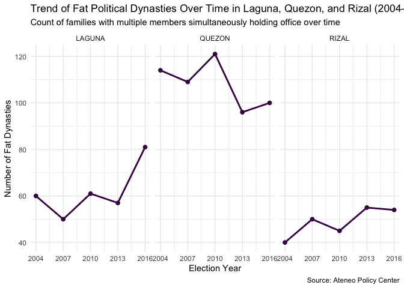
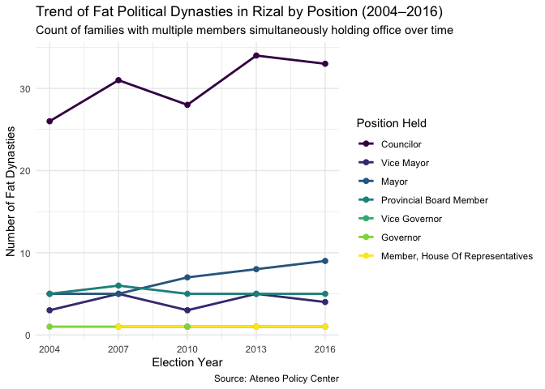
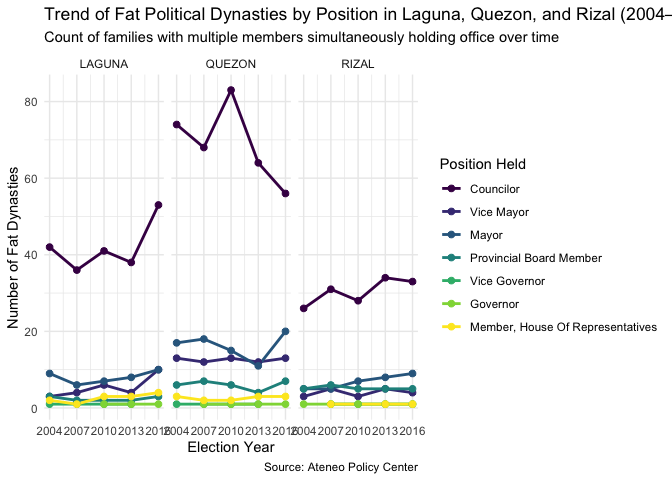

Dynasty
================
RB Raya
2025-11-07

``` r
library(tidyverse)
```

    ## Warning: package 'ggplot2' was built under R version 4.4.1

    ## ── Attaching core tidyverse packages ──────────────────────── tidyverse 2.0.0 ──
    ## ✔ dplyr     1.1.4     ✔ readr     2.1.5
    ## ✔ forcats   1.0.0     ✔ stringr   1.5.1
    ## ✔ ggplot2   4.0.0     ✔ tibble    3.2.1
    ## ✔ lubridate 1.9.3     ✔ tidyr     1.3.1
    ## ✔ purrr     1.0.2     
    ## ── Conflicts ────────────────────────────────────────── tidyverse_conflicts() ──
    ## ✖ dplyr::filter() masks stats::filter()
    ## ✖ dplyr::lag()    masks stats::lag()
    ## ℹ Use the conflicted package (<http://conflicted.r-lib.org/>) to force all conflicts to become errors

``` r
library(readxl)
library(viridis)
```

    ## Loading required package: viridisLite

``` r
dynasty <- read_excel("dynasty.xlsx")

dynasty <- dynasty %>% 
  mutate(`Last Name` = str_to_title(`Last Name`),
         Position = str_to_title(Position))
```

## Plots

``` r
dynasty <- dynasty %>% 
   mutate(Position = fct_relevel(Position,
                                 "Councilor", 
                                 "Vice Mayor",
                                 "Mayor",
                                 "Provincial Board Member",
                                 "Vice Governor", 
                                 "Member, House of Representatives",
                                 "Governor", 
                                 ))
```

    ## Warning: There was 1 warning in `mutate()`.
    ## ℹ In argument: `Position = fct_relevel(...)`.
    ## Caused by warning:
    ## ! 1 unknown level in `f`: Member, House of Representatives

``` r
dynasty %>% 
  filter(Province == "RIZAL", fat == 1) %>% 
    ggplot(aes(x = after_stat(count), y = fct_rev(fct_infreq(`Last Name`)), fill = Position)) +
    geom_bar(stat = "count", position = "stack", color = "black") +
  labs(
      title = "Number of Fat Political Dynasties by Position in Rizal Province (2004–2016)",
      x = "Number of Members",
      y = "Last Name", 
      caption = "Source: Ateneo Policy Center"
    ) +
    theme_minimal() +
    scale_fill_viridis_d()
```

<!-- -->

``` r
dynasty %>%
  filter(Province == "RIZAL", fat == 1) %>%
  group_by(Year) %>%
  summarise(Dynasty_Count = n()) %>%
  ungroup() %>%
  ggplot(aes(x = Year, y = Dynasty_Count)) +
 geom_line(color = "#440154FF", size = 1) + 
  geom_point(color = "#440154FF", size = 2) +
  labs(
    title = "Trend of Fat Political Dynasties Over Time in Rizal (2004–2016)",
    subtitle = "Count of families with multiple members simultaneously holding office over time",
    x = "Election Year",
    y = "Number of Fat Dynasties", 
    caption = "Source: Ateneo Policy Center"
  ) +
  scale_x_continuous(breaks = unique(dynasty$Year)) +
  scale_color_viridis_d() +
  theme_minimal()
```

    ## Warning: Using `size` aesthetic for lines was deprecated in ggplot2 3.4.0.
    ## ℹ Please use `linewidth` instead.
    ## This warning is displayed once every 8 hours.
    ## Call `lifecycle::last_lifecycle_warnings()` to see where this warning was
    ## generated.

<!-- -->

``` r
dynasty %>%
  filter(Province %in% c("RIZAL", "LAGUNA", "QUEZON"), fat == 1) %>%
  group_by(Year, Province) %>%
  summarise(Dynasty_Count = n()) %>%
  ungroup() %>%
  ggplot(aes(x = Year, y = Dynasty_Count)) +
 geom_line(color = "#440154FF", size = 1) + 
  geom_point(color = "#440154FF", size = 2) +
  labs(
    title = "Trend of Fat Political Dynasties Over Time in Laguna, Quezon, and Rizal (2004–2016)",
    subtitle = "Count of families with multiple members simultaneously holding office over time",
    x = "Election Year",
    y = "Number of Fat Dynasties", 
    caption = "Source: Ateneo Policy Center"
  ) +
  scale_x_continuous(breaks = unique(dynasty$Year)) +
  scale_color_viridis_d() +
  theme_minimal() +
  facet_wrap(~Province, nrow = 1)
```

    ## `summarise()` has grouped output by 'Year'. You can override using the
    ## `.groups` argument.

<!-- -->

``` r
dynasty %>%
  filter(Province == "RIZAL", fat == 1) %>% 
  group_by(Year, Position) %>%
  summarise(fat_count = n(), .groups = 'drop') %>%
  ggplot(aes(x = Year, y = fat_count, color = Position)) +
  geom_line(size = 1) + 
  geom_point(size = 2) + 
  scale_color_viridis_d() +
  labs(
    title = "Trend of Fat Political Dynasties in Rizal by Position (2004–2016)",
    subtitle = "Count of families with multiple members simultaneously holding office over time",
    x = "Election Year",
    y = "Number of Fat Dynasties",
    color = "Position Held",
    caption = "Source: Ateneo Policy Center"
  ) +
  scale_x_continuous(breaks = unique(dynasty$Year)) +
  theme_minimal() 
```

<!-- -->

``` r
dynasty %>%
  filter(Province %in% c("RIZAL", "LAGUNA", "QUEZON"), fat == 1) %>% 
  group_by(Year, Position, Province) %>%  
  summarise(fat_count = n(), .groups = 'drop') %>%
  ggplot(aes(x = Year, y = fat_count, color = Position)) +
  geom_line(size = 1) + 
  geom_point(size = 2) + 
  scale_color_viridis_d() +
  labs(
    title = "Trend of Fat Political Dynasties by Position in Laguna, Quezon, and Rizal (2004–2016)",
    subtitle = "Count of families with multiple members simultaneously holding office over time",
    x = "Election Year",
    y = "Number of Fat Dynasties",
    color = "Position Held",
    caption = "Source: Ateneo Policy Center"
  ) +
  scale_x_continuous(breaks = unique(dynasty$Year)) +
  theme_minimal() +
  facet_wrap(~Province, nrow = 1)
```

<!-- -->
